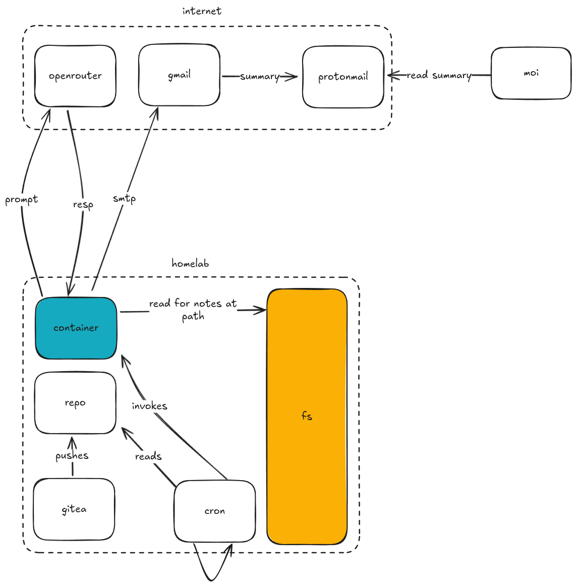

# llm-notes-cron

Quick script for:

- Loading some instructions
- Loading some context from notes, specified at some plaintext files on the fs
- Hitting some openrouter api
- Forwarding the results to an email

See:

  

